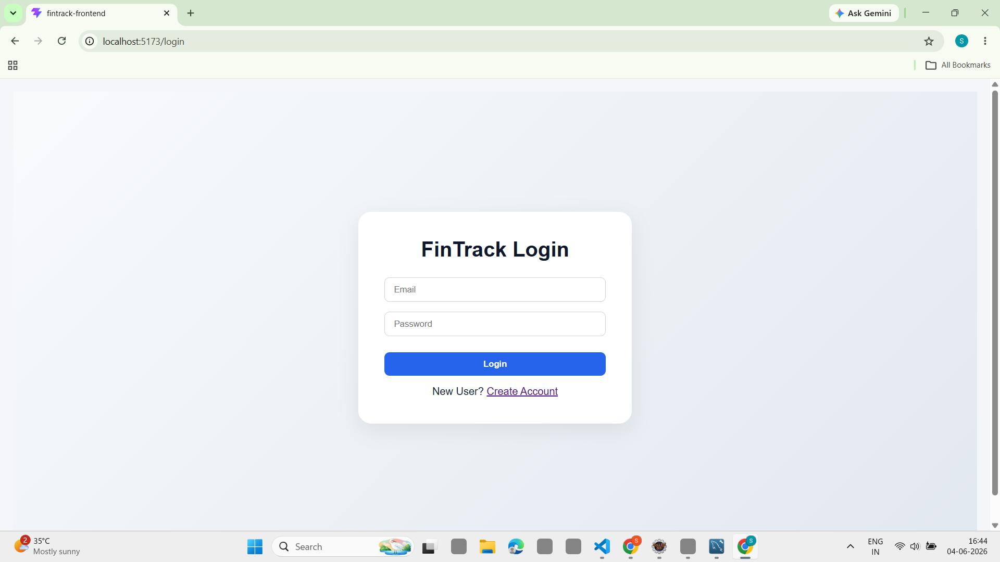
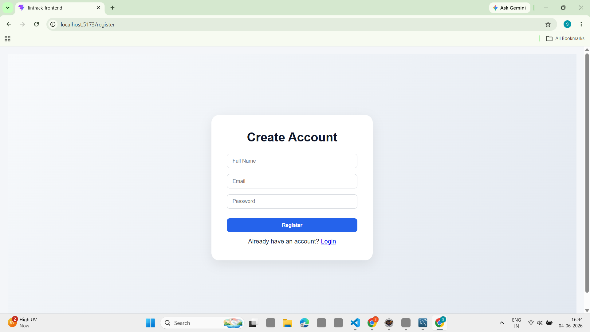
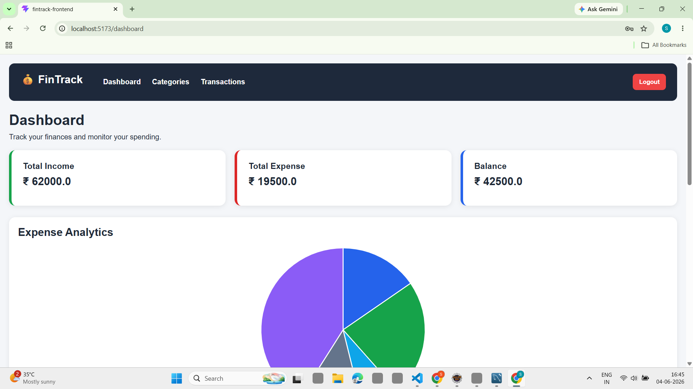
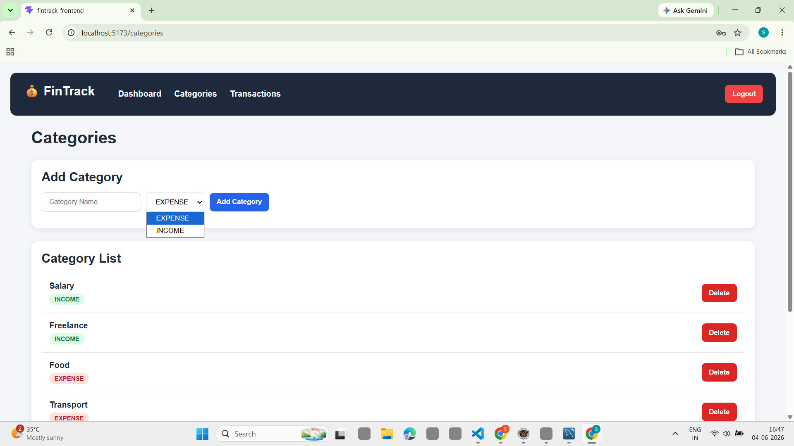
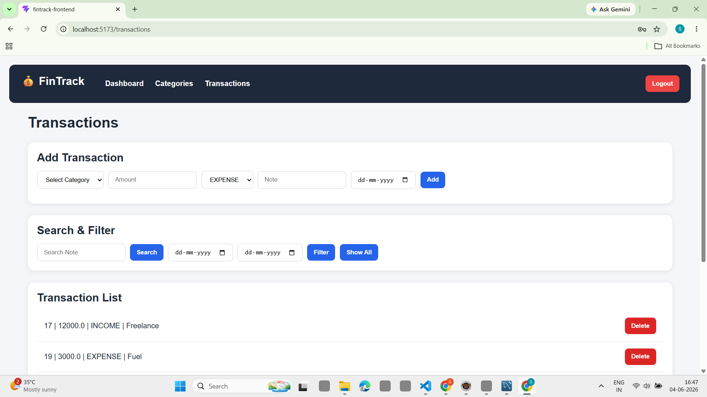

# FinTrack Frontend

A modern Personal Finance Management Application built using React that helps users track income, expenses, categories, and transactions through an interactive dashboard.

## Features

- User Registration
- User Login & Logout
- Protected Routes
- Dashboard Summary Cards
- Income & Expense Tracking
- Category Management
- Transaction Management
- Transaction Search
- Date Range Filtering
- Category-wise Expense Analytics
- Financial Insights Dashboard
- Interactive Pie Charts using Chart.js
- Responsive User Interface

## Dashboard Analytics

The dashboard provides:

- Total Income
- Total Expense
- Current Balance
- Highest Spending Category
- Expense Ratio Analysis
- Transaction Statistics
- Category-wise Expense Distribution

## Tech Stack

### Frontend

- React.js
- React Router DOM
- Axios
- Chart.js
- React ChartJS 2
- Vite
- CSS3

### Backend

- Java Servlets
- JDBC
- MySQL
- Apache Tomcat

## Project Structure

src/

├── components/

├── pages/

├── services/

└── App.jsx

## Screenshots

### Login Page

### User Registration

### Dashboard

### Categories

### Transactions

## Future Enhancements

- Loan & Lending Management
- Monthly Budget Tracking
- Budget Goal Monitoring
- AI-based Spending Insights
- Expense Prediction & Trend Analysis
- Export Reports (PDF/Excel)
- Advanced Financial Analytics

## Author

Shravan Shaha
